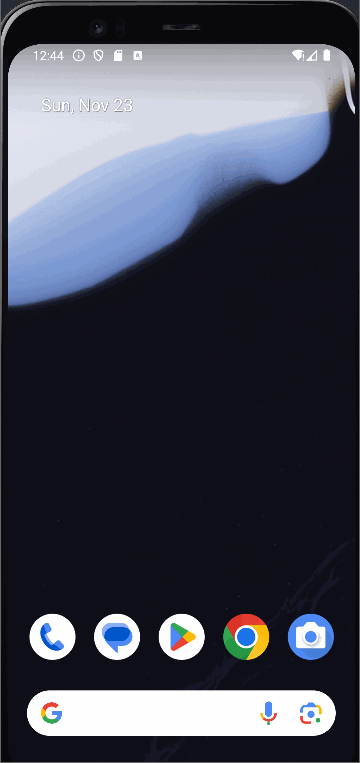
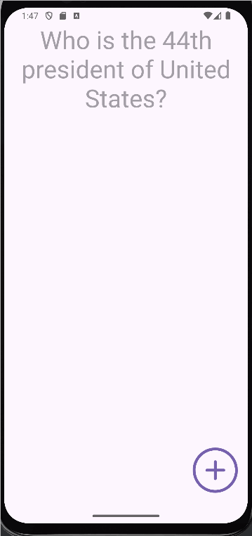

## FlashcardApp

## Lab 1

### App Description
Flashcard App lets you create, save, and review cards anytime.
Study smarter, learn faster, and keep knowledge at your fingertips.

### App Walk-though

 

## Required
- [X] Create New Project in Android Studio
- [X] Add a view for the front side of the flashcard to display the question
- [X] Add a view for the back side of the flashcard to display the answer
- [X] Build in logic to show the answer side when the card is tapped
- [X] Push code to GitHub

## Lab 2

### App Walk-though

 

## Required
- [X] Add a "+" button that takes the user to new "Add Card Screen"
- [X] Add a Cancel button to the "Add Card Screen"
- [X] Add a two fields to the "Add Card Screen" that will allow the user to enter the question and the answer
- [X] Add a Save button that will dismiss "Add Card Screen" and return to the Main Activity where the user can see the card they just created
- [X] Push code to GitHub

